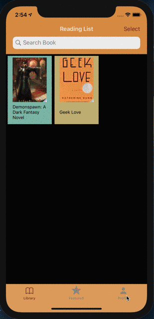
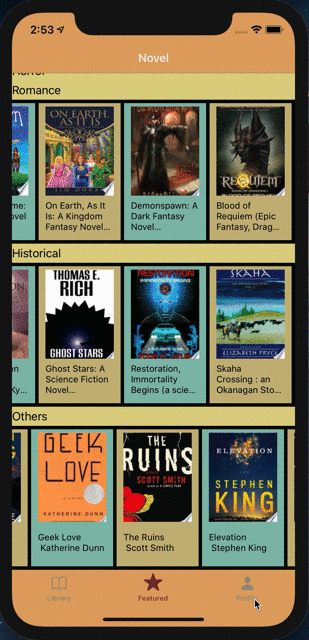
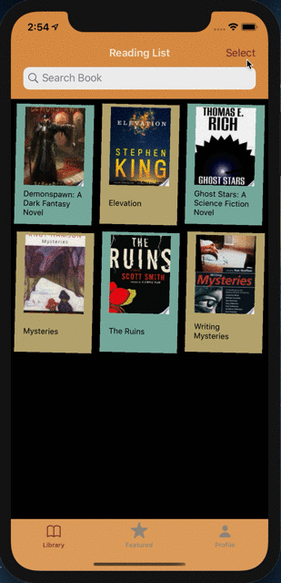
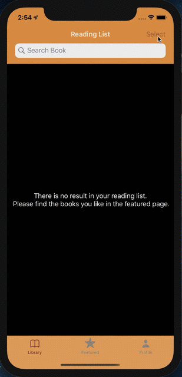
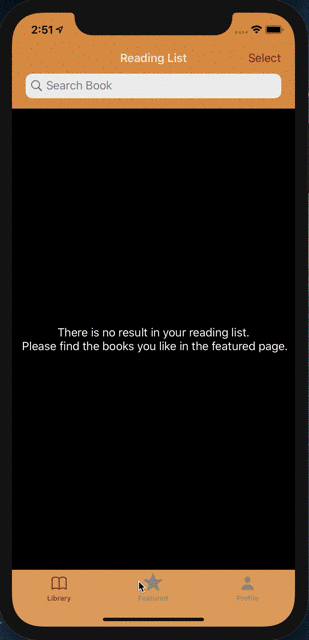

May 27 Wednsday
# Project: Touch Novel

Touch Novel is a demo project for reading various Novels being dynamically fetched from the Google Books API.

The idea was to leverage various third-party libraries that I wanted to use.

App Demo:  portrait: https://drive.google.com/file/d/1xCbv860xuWQXqTK_UHqABNE7VGW7mNgT/view?usp=sharing
                    landscape: https://drive.google.com/file/d/1580e9i6b2jOs2W3zqAjsJZPiwMJtDsfn/view?usp=sharing

Project need pod install before run

        

Third-Party Libraries being used:

    1. Alamofire: 
    Alamofire provides a variety of convenience methods for making HTTP requests.  
    -> I use it to get data from API

    2. Nuke:
    Nuke provides a simple and efficient way to download and display images in your app. Behind its clear and concise API is an advanced architecture which enables its unique features and offers virtually unlimited possibilities for customization.  
    -> I use it to load Image from url.

    3. ViewAnimator
    ViewAnimator is a library for building complex iOS UIView animations in an easy way. It provides one line animations for any view included the ones which contain other views like UITableView and UICollectionView with its cells or UIStackView with its arrangedSubviews.
    -> I use it to animate the collection cell in the tabBarController First page

    4. MBProgressHUD
    MBProgressHUD is an iOS drop-in class that displays a translucent HUD with an indicator and/or labels while work is being done in a background thread.
    -> I use it to be an activity indicator when the webkit view is loading web page (using in WebViewController)

Code Updates: 

    1. use CoreData to implement offline mode
    2. click the collection item in the table view cell, it will push to the webkit view controller show details.
    3. using ESPullToRefresh library
    4. add Search controller
    // new updates
    5. add favorite books screen

Feature work:

    1. wanna fix some bugs about login page
    2. wanna improve the appearance of the profile page. 

